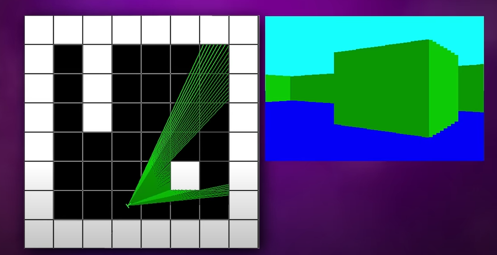
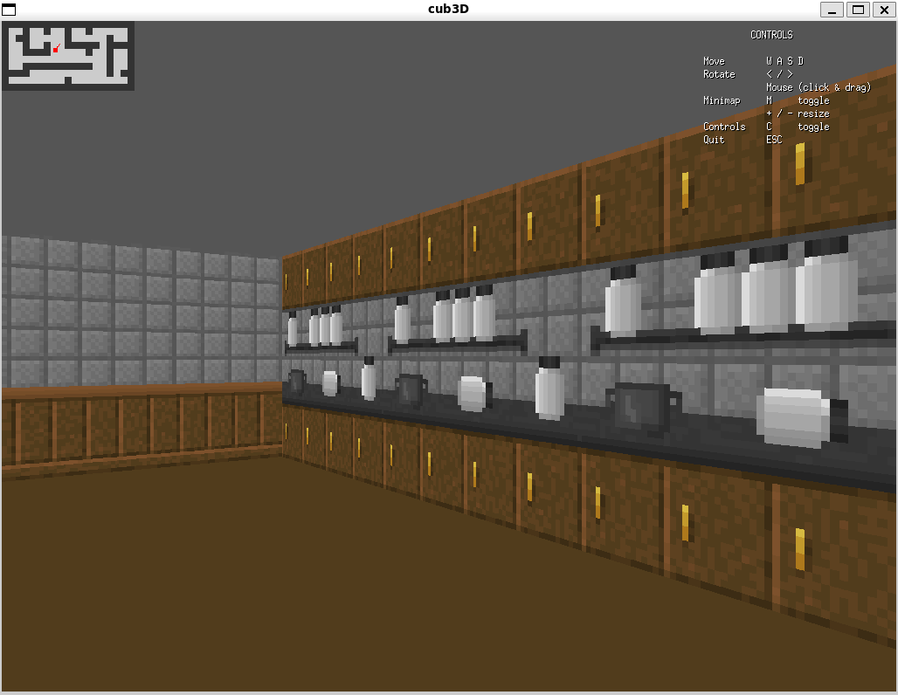
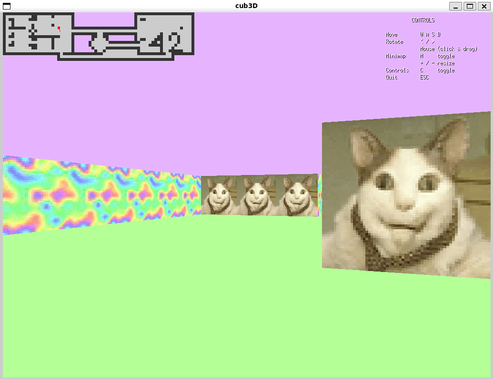
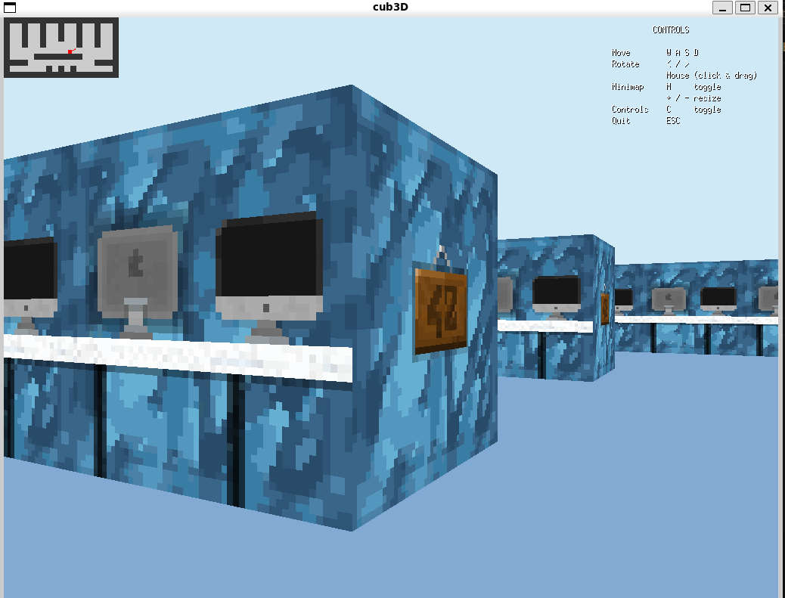
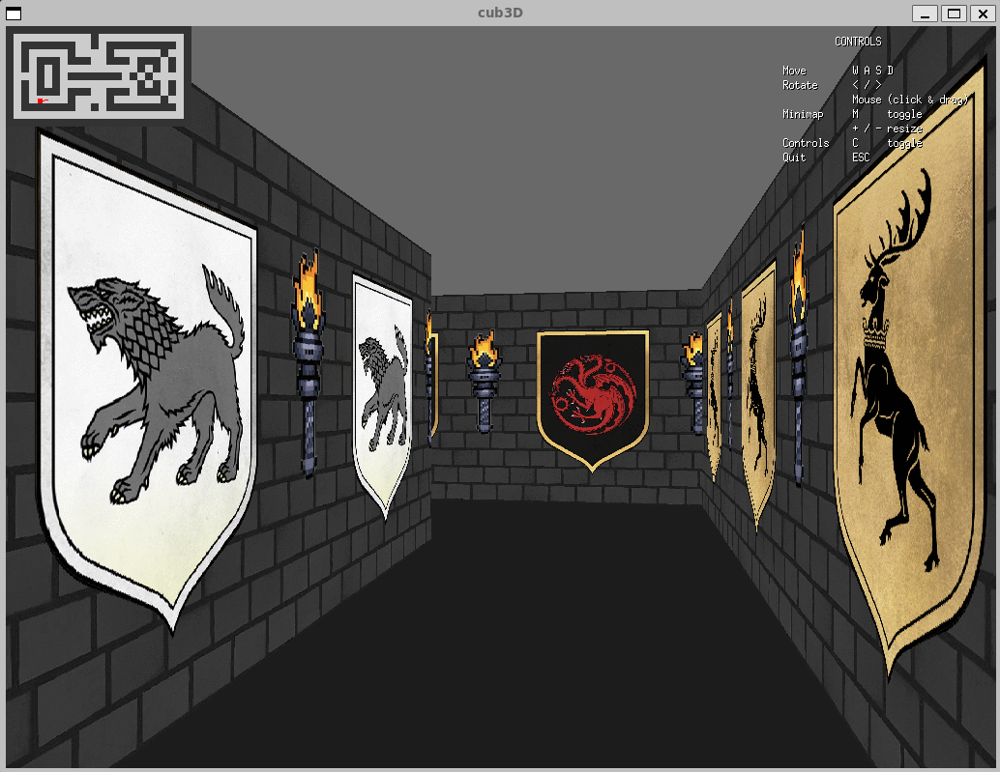
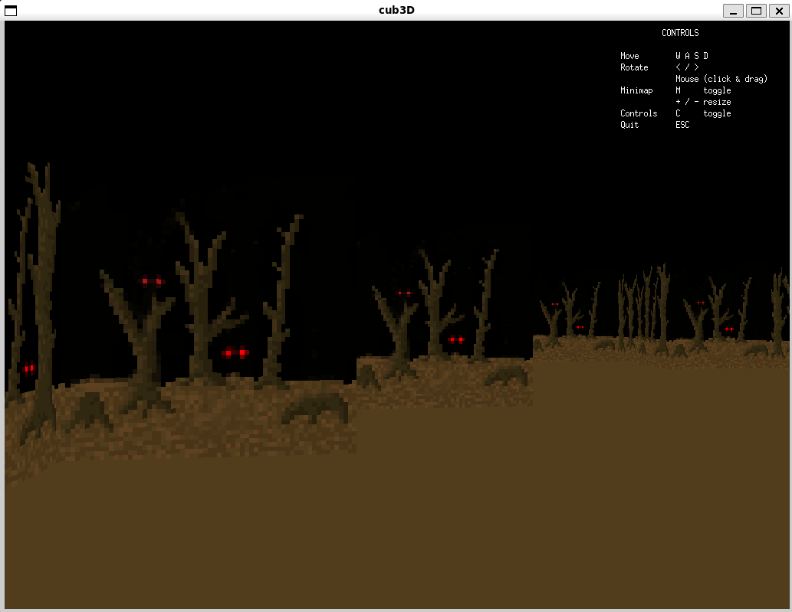
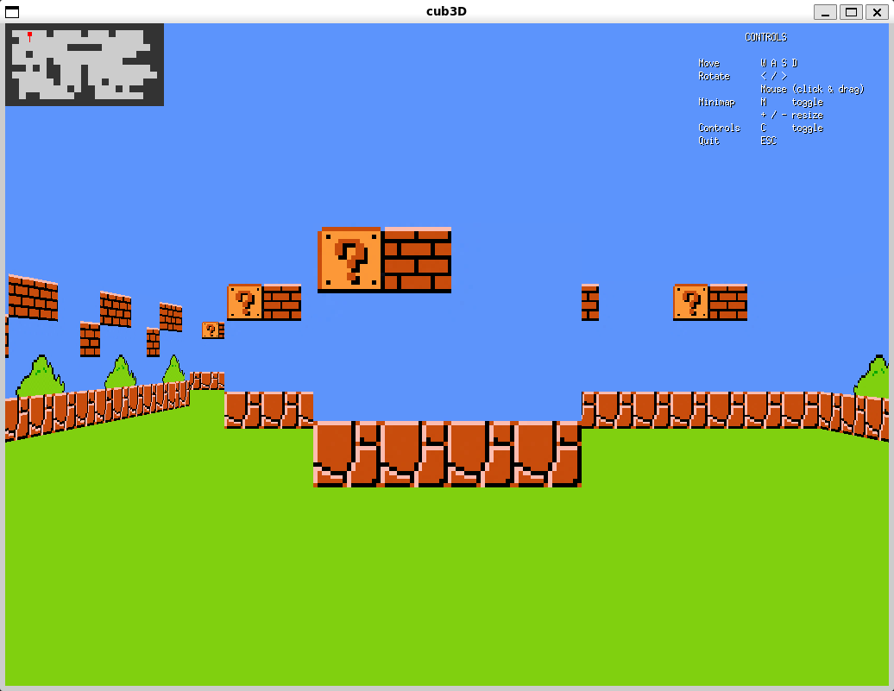
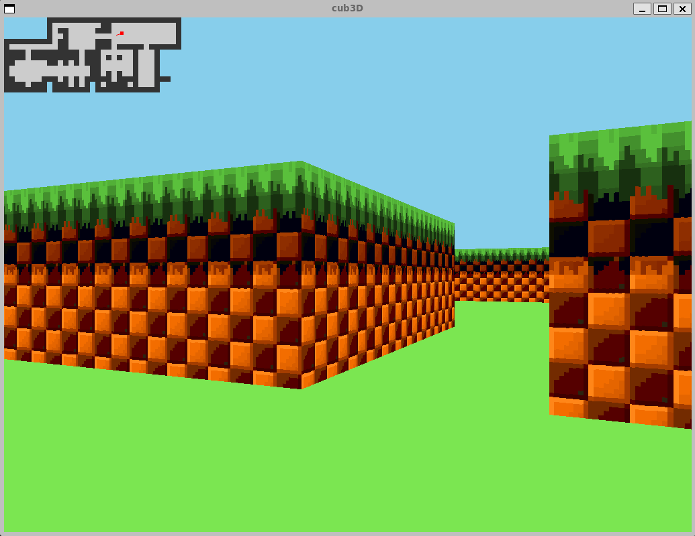
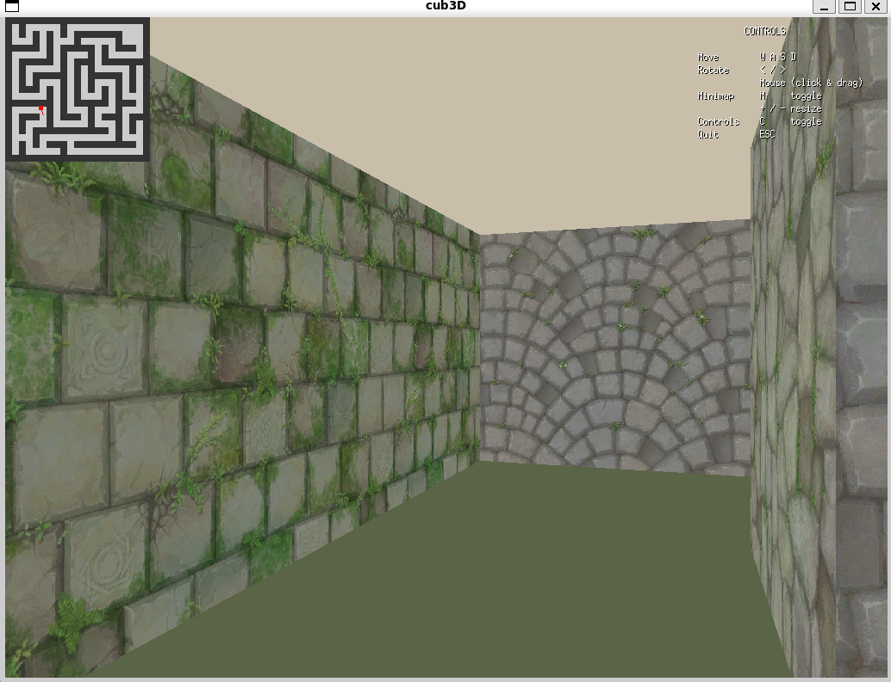

## cub3d
```
FINAL GRADE: 115/100
```
Made by [@prosviriakova](https://github.com/prosviriakova) and [@mglikenf](https://github.com/mglikenf).

### 📖 Description
Cub3D is a 42 School team project inspired by the iconic game Wolfenstein 3D. The goal of this project is to implement a pseudo-3D maze renderer using ray-casting techniques in C, with the help of the miniLibX library. This project enhances understanding of graphics programming, algorithmic design, and teamwork.
<p align="center">
  
</p>

### 📦 Installation
To clone this repository with its submodules (e.g. libft, minilibx):
```bash
git clone --recursive git@github.com:42-mates/cub3d.git
```

If you cloned the repository **without** the `--recursive` flag:
```bash
git submodule update --init --recursive
```

### 🚀 Features
- **Ray-Casting Implementation:** Uses mathematical calculations to simulate a 3D view in a 2D space.
- **Interactive Controls:**
    -  Move through the maze using <kbd>W</kbd>, <kbd>A</kbd>, <kbd>S</kbd>, <kbd>D</kbd> keys.
    -  Rotate the view using <kbd>←</kbd> and <kbd>→</kbd> arrow keys.
    -  Exit the program cleanly using <kbd>ESC</kbd> or the window’s close button.
- **Customizable Map Loading:**
  - Accepts `.cub` files to define the maze layout, wall textures, and floor/ceiling colors.
  - Validates map integrity to ensure walls enclose the maze.
- **Textured Walls:** Displays different textures for walls based on their orientation (North, South, East, West).
- **Dynamic Colors:** Customizable floor and ceiling colors via RGB values specified in the `.cub` file.

### ✨ Bonus Features
- ✅ Wall collisions.
- ✅ Minimap system.
- ✅ Rotate the point of view with the mouse.
- ❌ Doors that can open and close.
- ❌ Animated sprites.

### 🖼️ Map Previews

<p align="center">
  
  
</p>
<p align="center">
  
  
</p>
<p align="center">
  
  
</p>
<p align="center">
  
  
</p>

